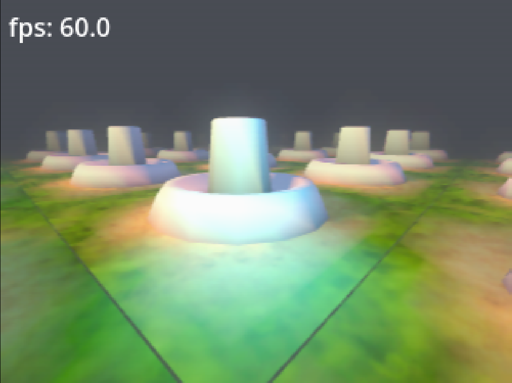

# "Retro Lighting System"

An Retro-Style rendering pipeline for Godot 4.6+, built as a GDExtension (C++) with accompanying shaders. Aims to faithfully recreate the look and feel of the retro fixed-function graphics hardware — vertex lighting, RDP color combiner, color quantization, dithering, and VI post-processing — all running in real-time.



## Features

- **RLS RSP Vertex Lighting** — Up to 7 directional lights + 1 ambient, calculated per-vertex just like the real hardware. Includes point light support for dynamic effects.
- **RDP Color Combiner** — A full implementation of the retro multi-cycle color combiner as a Godot shader include, supporting all the blending modes the original hardware offered.
- **Post-Processing (RDP VI)** — Screen-space color quantization, ordered dithering, horizontal VI interpolation, and gamma correction to nail that distinctive retro framebuffer look.
- **Custom Light Nodes** — `RLS_DirectionalLight3D` and `RLS_PointLight3D` nodes that act as RSP-style light proxies, managed by a `RLS_VertexLightManager3D`.
- **Editor Integration** — Custom gizmos for light visualization in the Godot editor.
- **Metallic / Matcap Support** — Includes a metallic reflection shader using matcap textures.

## Project Structure

```
src/                          # C++ GDExtension source
├── rls_directional_light_3d  # RSP-style directional light node
├── rls_point_light_3d        # Point light node
├── rls_vertex_light_manager  # Manages light state and pushes uniforms
├── rls_lit_mesh_instance_3d  # Mesh instance with per-vertex lighting
├── rls_editor_plugin         # Editor plugin registration
├── rls_light_gizmo_plugin    # Custom gizmos for light nodes
└── register_types            # GDExtension entry point

project/                      # Godot demo project
├── shaders/
│   ├── GenericVertexLit.gdshader       # Standard vertex-lit material
│   ├── GenericVertexLitBlend.gdshader  # Vertex-lit with blending
│   ├── Metallic.gdshader               # Matcap metallic shader
│   ├── post/RDPpost.gdshader           # RLS VI post-processing
│   └── shaderinclude/RDPcombiner.gdshaderinc  # RDP color combiner
└── addons/
    └── rls_visuals_billboards/         # Billboard addon
```

## Requirements

- [Godot 4.6+](https://godotengine.org/) (GL Compatibility renderer)
- [SCons](https://scons.org/) build system
- C++ compiler (GCC, Clang, or MSVC)
- The included `godot-cpp` submodule from the official upstream repository

## Submodules

This project uses the official upstream [`godot-cpp`](https://github.com/godotengine/godot-cpp) repository as a Git submodule.

## Building

1. Clone the repository with submodules:
   ```bash
   git clone --recurse-submodules https://github.com/PurpBatBoi/GodotRetroStuff.git
   cd GodotRetroStuff
   ```

2. If you already cloned without submodules:
   ```bash
   git submodule update --init --recursive
   ```

3. Build the GDExtension:
   ```bash
   scons          # debug build
   scons target=template_release  # release build
   ```

4. Open the `project/` folder in Godot.

### Web Builds

Web export is supported for the C++ GDExtension, but this project currently targets the non-threaded web export path only.

- Use `threads=false` when building the web GDExtension with SCons.
- The checked-in web `.gdextension` entries point only to the non-threaded `.wasm` binaries.
- This avoids the threaded web export path, which can require additional browser security headers and cross-origin isolation handling.

## Usage

### Shaders Only (No C++ Required)

If you just want the RLS look without the custom lighting nodes, copy the following into your Godot project:

- `project/shaders/` — All shader files
- `project/shaders/post/RDPpost.gdshader` — Apply to a full-screen quad for the retro post-processing look

### Full Pipeline (With GDExtension)

For the complete experience including RSP-style vertex lighting:

1. Build the extension (see above)
2. Copy `project/bin/` into your Godot project
3. Copy the shader files from `project/shaders/`
4. Add `RLS_VertexLightManager3D` to your scene
5. Add `RLS_DirectionalLight3D` or `RLS_PointLight3D` nodes for lighting
6. Use `RLS_LitMeshInstance3D` for meshes that should receive vertex lighting

## License

[MIT](LICENSE.md)

## AI Disclosure

OpenAI's "[CODEX](https://openai.com/codex/)" was used in the creation of this.
